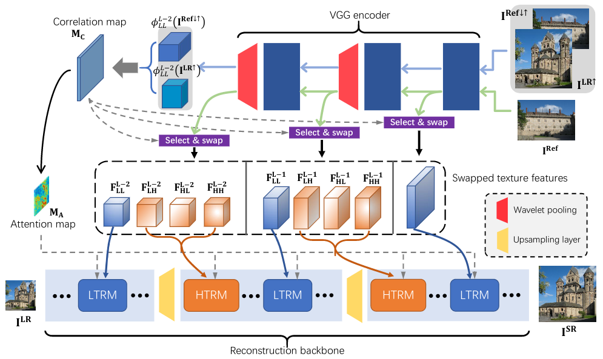
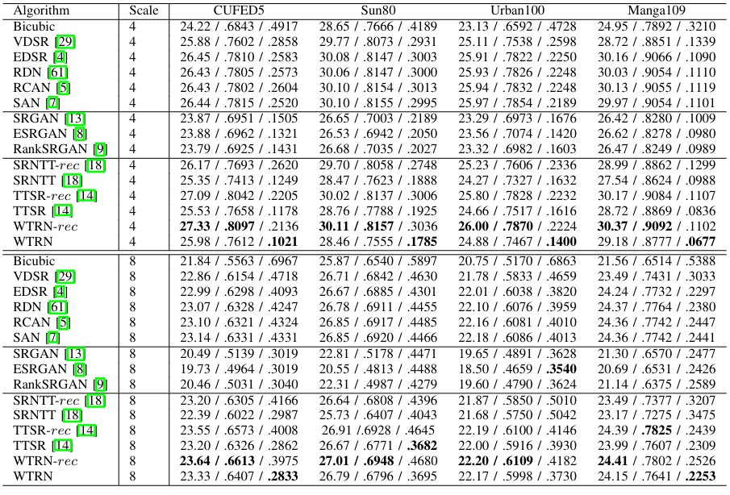
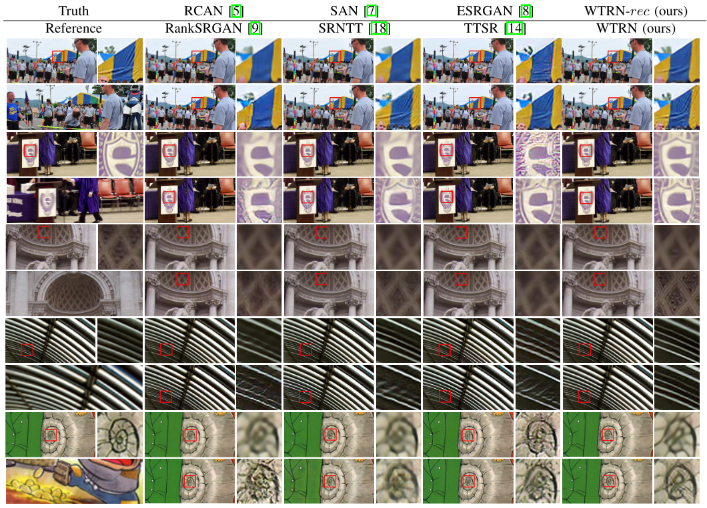

# WTRN-TIP
Official PyTorch implementation of our TIP2022 paper Wavelet-Based Texture Reformation Network for
Image Super-Resolution [arXiv]

[Zhen Li](https://github.com/Paper99)\*, [Zeng-Sheng Kuang](https://github.com/zskuang58)\*, [Zuo-Liang Zhu](https://github.com/NK-CS-ZZL), Hong-Peng Wang, Xiu-Li Shao (\* denotes equal contribution)

Nankai University

---

> Most reference-based image super-resolution (RefSR) methods directly leverage the raw features extracted from a pretrained VGG encoder to transfer the matched texture information from a reference image to a low-resolution image. We argue that simply operating on these raw features neglects the influence of irrelevant and redundant information and the importance of abundant high-frequency representations, leading to undesirable texture matching and transfer results. Taking the advantages of wavelet transformation, which represents the contextual and textural information of features at different scales, we propose a **W**avelet-based **T**exture **R**eformation **N**etwork (**WTRN**) for RefSR. We first decompose the extracted texture features into low-frequency and high-frequency sub-bands and conduct feature matching on the low-frequency component. Based on the correlation map obtained from the feature matching process, we then separately swap and transfer wavelet-domain features at different stages of the network. Furthermore, a wavelet-based texture adversarial loss is proposed to make the network generate more visually plausible textures. Experiments on four benchmark datasets demonstrate that our proposed method outperforms previous RefSR methods both quantitatively and qualitatively.




## TODO
- [ ] Update arXiv link 
- [ ] Update pretrained models

## Dependencies

* python >= 3.7
* python packages: `pip install opencv-python imageio tensorboard tqdm`
* pytorch >= 1.1.0
* torchvision >= 0.4.0

## Prepare Dataset 

1. Download [CUFED train set](https://drive.google.com/drive/folders/1hGHy36XcmSZ1LtARWmGL5OK1IUdWJi3I) and [CUFED test set](https://drive.google.com/file/d/1Fa1mopExA9YGG1RxrCZZn7QFTYXLx6ph/view)
1. Place the datasets in this structure:
    ```
    CUFED
    ├── train
    │   ├── input
    │   └── ref 
    └── test  
    ```

## Download codes

1. Clone this repo
    ```
    git clone https://github.com/zskuang58/WTRN-TIP.git
    cd WTRN-TIP
    ```

## Evaluation

1. Prepare pre-trained models and modify "model_path" in eval.sh

1. Prepare CUFED dataset and modify "dataset_dir" in eval.sh

1. Run evaluation
    ```
    sh eval.sh
    ```
1. Evaluation results are in "save_dir" (default: `./eval/CUFED/WTRN`)

## Training

1. Prepare CUFED dataset and modify "dataset_dir" in train.sh
1. Run training
    ```
    sh train.sh
    ```
1. The training results are in the "save_dir" (default: `./train/CUFED/WTRN`)

## Results
### Quantitative results


### Visual results


## Acknowledgement

We borrow some codes from [TTSR](https://github.com/researchmm/TTSR) and [WCT2](https://github.com/clovaai/WCT2). We thank the authors for their great works.

## Citation

Please consider citing our paper in your publications if it is useful for your research.
```
@article{li2022wtrn,
    author = {Li, Zhen and Kuang, Zeng-Sheng and Zhu, Zuo-Liang and Wang, Hong-Peng and Shao, Xiu-Li},
    title = {Wavelet-Based Texture Reformation Network for Image Super-Resolution},
    journal = {IEEE Transactions on Image Processing},
    year= {2022},
    doi={10.1109/TIP.2022.3160072}
}
```
